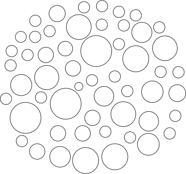

# OverLapsJs

Librería en JavaScript para animación de sobreposición de elementos on scroll en pantalla.

El codigo necesario se encuentra en /app.js y overlapsJs.css

- incluir overlapsJs.css como estilos del proyecto
- incluir app.js como script de tu proyecto

Requerido: JQuery


Agregar la clase `overlapo-up-element` al contenedor anterior en donde se va a implementar el efecto de animación de scroll
```
<div class="overlap-up-element"></div>
```
Agregar la clase `overlapo-bottom-element` al contenedor posterior en donde se va a implementar el efecto de animación de scroll

```
<div class="overlap-bottom-element"></div>
```

Ejemplo de implementación

```

<html>
    <head>
        <meta charset="UTF-8">
        <meta http-equiv="X-UA-Compatible" content="IE=edge">
        <meta name="viewport" content="width=device-width, initial-scale=1.0">
        <title>Overlaps Js</title>
        <link rel="stylesheet" href="overlapsJs.css">
        <script src="https://code.jquery.com/jquery-3.7.0.min.js"
            integrity="sha256-2Pmvv0kuTBOenSvLm6bvfBSSHrUJ+3A7x6P5Ebd07/g=" crossorigin="anonymous"></script>
        <script src="app.js"></script>
    </head>

    <body>
        <div class="overlap-up-element">
          <h1>Titulo de tu sitio</h1>
          <p>Lorem ipsum.....</p>
        </div>

        //Contenedor de los elementos a sobreponer mendiante scroll
        <div class="overlap-container">

                // Primer elemento del conjunto de sobreposiciones
                // Imagen del elemento
                <div class="overlap-child">
                    
                </div>
                //Texto del elemento
                <div class="overlap-child-text">
                    <p> Porcentaje de bacterias registradas en el cuerpo humano.</p>
                </div>


                // Segundo elemento del conjunto de sobreposiciones
                // Imagen del elemento
                <div class="overlap-child">
                    
                </div>
                //Texto del elemento
                <div class="overlap-child-text">
                    <p>Cantidad de bacterias bacteroidetes en el cuerpo Lorem ipsum dolor sit amet consectetur adipisicing elit.
                        Voluptatem, minus veritatis quaerat dolorum anim</p>
                </div>
                .
                .
                .

         </div>


         <div class="overlap-bottom-element">
            <p>Lorem ipsum.....</p>
        </div>

     </body>
 
 </html>
 ```

DEMO: https://overlapsjsdemo.netlify.app/

